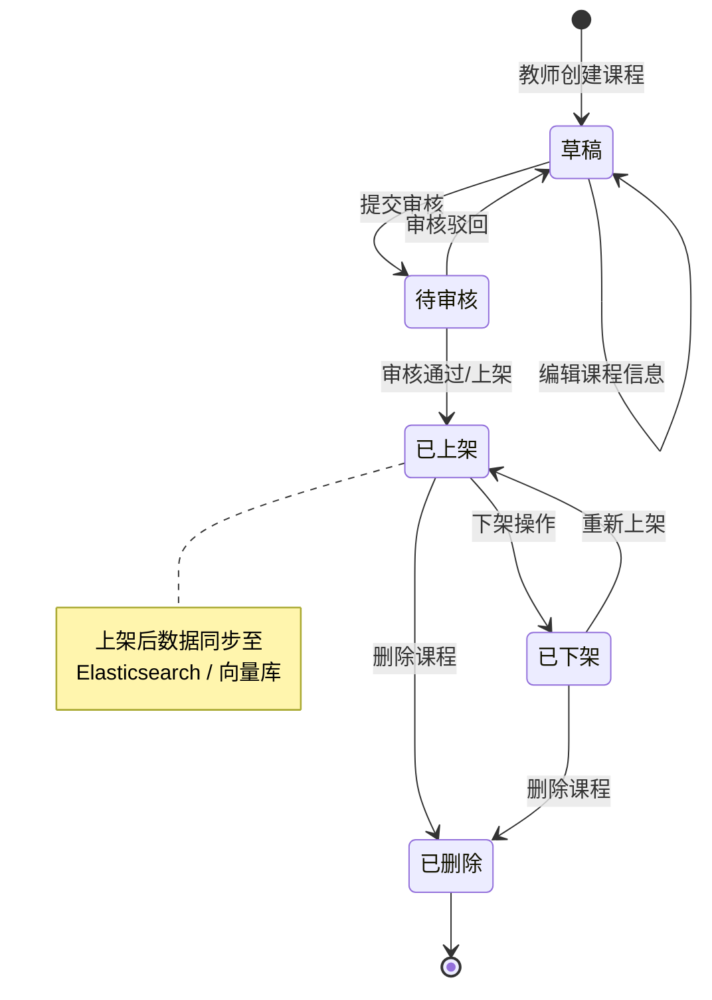
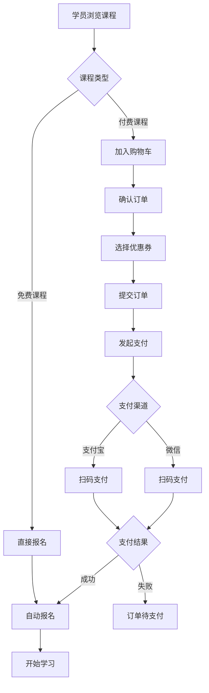
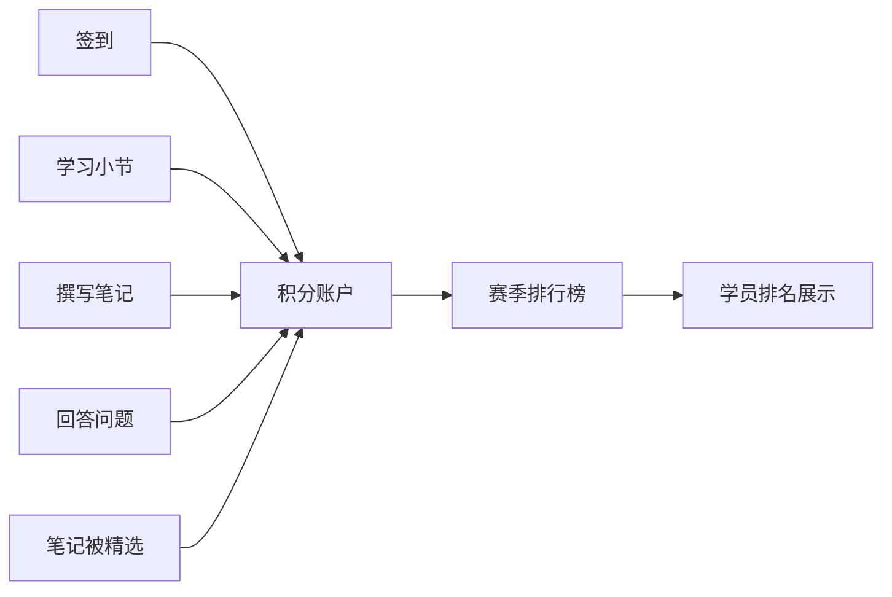
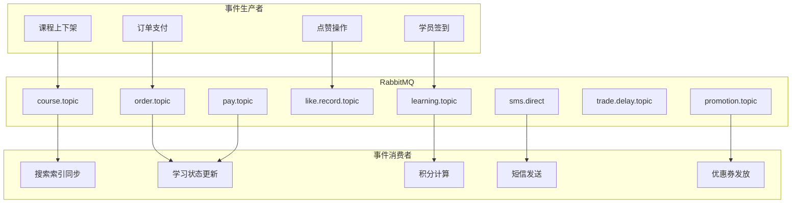

# Eduverse (天机学堂)

<div align="center">

**一站式在线教育平台 | 微服务架构 | Spring AI 智能体**

[](https://spring.io/projects/spring-boot)
[](https://spring.io/projects/spring-cloud)
[](https://spring.io/projects/spring-ai)
[](https://openjdk.org/projects/jdk/17/)
[](LICENSE)

</div>

---

## 目录

- [项目背景](#项目背景)
- [架构设计](#架构设计)
- [技术栈](#技术栈)
- [模块说明](#模块说明)
- [功能演示](#功能演示)
- [业务流程图](#业务流程图)
- [快速开始](#快速开始)
- [部署指南](#部署指南)
- [API 文档](#api-文档)
- [贡献指南](#贡献指南)

---

## 项目背景

Eduverse（天机学堂）是一个面向**在线教育场景**的全栈微服务平台，由传智教育研究院研发。平台覆盖从课程管理、学员报名、在线学习、互动答疑、考试测评到支付结算、营销推广、数据分析和 AI 智能辅导的完整业务闭环。

### 核心目标

- **学员端**：提供课程搜索、购买、学习、笔记、签到、积分排行、AI 答疑等一站式学习体验
- **教师/运营端**：提供课程制作、题目管理、优惠券发放、数据分析看板等管理工具
- **平台能力**：基于 Spring Cloud 微服务生态，支持高并发、可扩展的 SaaS 化部署

### 适用场景

- 企业内部培训平台
- 在线教育 SaaS 服务
- 知识付费平台
- 职业教育/考证培训系统

---

## 架构设计

### 系统架构图

```
┌──────────────────────────────────────────────────────────────────┐
│                         客户端 (Client)                           │
│               Web / Mobile / Mini Program / H5                    │
└─────────────────────────────┬────────────────────────────────────┘
                              │
                              ▼
┌──────────────────────────────────────────────────────────────────┐
│                    API 网关 (ev-gateway :10010)                    │
│              Spring Cloud Gateway + JWT 鉴权 + 跨域                │
└───────────────┬──────────────────────────────────────────────────┘
                │
    ┌───────────┼───────────┬───────────┬───────────┐
    ▼           ▼           ▼           ▼           ▼
┌─────────┐┌─────────┐┌─────────┐┌─────────┐┌─────────┐
│ 用户服务 ││ 课程服务 ││ 学习服务 ││ 交易服务 ││ 考试服务 │
│  :8082  ││  :8086  ││  :8090  ││  :8088  ││  :8089  │
└─────────┘└─────────┘└─────────┘└─────────┘└─────────┘
┌─────────┐┌─────────┐┌─────────┐┌─────────┐┌─────────┐
│ 支付服务 ││ 营销服务 ││ 搜索服务 ││ 媒体服务 ││ AI 服务 │
│  :8087  ││  :8092  ││  :8083  ││  :8084  ││  :8094  │
└─────────┘└─────────┘└─────────┘└─────────┘└─────────┘
┌─────────┐┌─────────┐┌─────────┐┌─────────┐
│ 消息服务 ││ 点评服务 ││ 数据服务 ││ 认证服务 │
│  :8085  ││  :8091  ││  :8093  ││  内部    │
└─────────┘└─────────┘└─────────┘└─────────┘
```

### 微服务分层架构

每个微服务遵循统一的分层设计：

```
┌─────────────────────────────────────────┐
│              Controller 层               │  接口暴露、参数校验
├─────────────────────────────────────────┤
│               Service 层                 │  业务逻辑编排
├─────────────────────────────────────────┤
│                Mapper 层                 │  数据访问 (MyBatis Plus)
├─────────────────────────────────────────┤
│              Domain / DTO 层             │  领域对象、数据传输对象
└─────────────────────────────────────────┘
        │                       │
        ▼                       ▼
┌──────────────┐    ┌──────────────────────┐
│   MySQL 8.0  │    │  Redis / Redisson    │
│ (Database    │    │  (分布式锁 / 缓存)    │
│  per Service)│    └──────────────────────┘
└──────────────┘
```

### 基础设施依赖

```
    ┌──────────┐  ┌───────────┐  ┌───────────┐  ┌──────────┐
    │  Nacos   │  │ RabbitMQ  │  │ XXL-Job   │  │  Seata   │
    │ 注册/配置 │  │  消息队列  │  │ 定时任务   │  │ 分布式事务│
    └──────────┘  └───────────┘  └───────────┘  └──────────┘
    ┌──────────┐  ┌───────────┐  ┌───────────┐
    │ 阿里云   │  │ 腾讯云    │  │ Elastic-  │
    │ OSS/KMS  │  │ COS/VOD   │  │ search    │
    │ 支付宝   │  │           │  │  7.12     │
    └──────────┘  └───────────┘  └───────────┘
```

---

## 技术栈

### 核心框架

| 技术 | 版本 | 说明 |
|------|------|------|
| Java | 17 | 运行环境 |
| Spring Boot | 3.3.5 | 应用框架 |
| Spring Cloud | 2023.0.3 | 微服务治理 (Gateway / OpenFeign / LoadBalancer) |
| Spring Cloud Alibaba | 2023.0.3.2 | Nacos 服务注册与配置中心 |
| Spring AI | 1.0.0 | AI 智能体框架 |
| MyBatis Plus | 3.5.9 | ORM 框架 |
| MySQL | 8.0.23 | 关系型数据库 |
| Redisson | 3.13.6 | 分布式锁 |
| Elasticsearch | 7.12.1 | 全文搜索引擎 |
| RabbitMQ | — | 异步消息队列 |
| XXL-Job | 2.3.1 | 分布式定时任务 |
| Seata | 1.5.1 | 分布式事务 |

### 工具库

| 技术 | 版本 | 说明 |
|------|------|------|
| Lombok | 1.18.36 | 代码简化 |
| Hutool | 5.8.36 | Java 工具集 |
| Knife4j | 2.2.19 | API 文档 (基于 OpenAPI 3) |
| Docker | — | 容器化部署 |

### 云服务集成

| 服务 | 用途 |
|------|------|
| 阿里云 OSS | 对象存储 |
| 阿里云 KMS | 密钥管理 |
| 阿里云 SMS | 短信服务 |
| 支付宝 SDK | 支付能力 |
| 腾讯云 COS | 对象存储 (备选) |
| 腾讯云 VOD | 视频点播 |

---

## 模块说明

### 模块总览

| 模块 | 端口 | 数据库 | 说明 |
|------|------|--------|------|
| `ev-gateway` | 10010 | — | API 网关，统一入口、路由转发、JWT 鉴权、跨域处理 |
| `ev-auth` | — | `tj_auth` | 认证授权服务 (JWT + RBAC)，含网关/资源 SDK |
| `ev-user` | 8082 | `tj_user` | 用户管理 (学员/教师/员工)，个人信息维护 |
| `ev-course` | 8086 | `tj_course` | 课程管理 (草稿/上架/下架)，目录/章节编排，分类管理 |
| `ev-learning` | 8090 | `tj_learning` | 学习中心：我的课表、学习记录、互动答疑、笔记、签到、积分排行榜 |
| `ev-exam` | 8089 | `tj_exam` | 题库管理、试题 CRUD、业务题目关联 |
| `ev-trade` | 8088 | `tj_trade` | 购物车、订单管理、退款申请 |
| `ev-pay` | 8087 | `tj_pay` | 支付通道 (支付宝/微信)，支付单/退款单管理 |
| `ev-promotion` | 8092 | `tj_promotion` | 优惠券管理、兑换码、用户优惠券 |
| `ev-search` | 8083 | `tj_search` | Elasticsearch 课程搜索、推荐、兴趣匹配 |
| `ev-message` | 8085 | `tj_message` | 短信发送、用户收件箱、消息模板、通知任务 |
| `ev-media` | 8084 | `tj_media` | 文件上传 (云存储)、视频 VOD 管理 |
| `ev-remark` | 8091 | `tj_remark` | 互动点赞 (问答/笔记) |
| `ev-data` | 8093 | `tj_data` | 数据分析看板 (今日数据/图表/排行榜) |
| `ev-aigc` | 8094 | `tj_aigc` | AI 智能体：路由/推荐/咨询/购买/知识辅导 |
| `ev-common` | — | — | 通用工具、自动配置、基础类 |
| `ev-api` | — | — | Feign 远程调用接口、共享 DTO |

### 核心模块详解

#### 1. 认证授权 (ev-auth)

- **JWT 双令牌机制**：Access Token + Refresh Token
- **RBAC 权限模型**：账户 → 角色 → 菜单 + 权限
- **网关 SDK**：Token 签发与验签 (RSA 密钥对，KeyStore 管理)
- **资源 SDK**：`LoginAuthInterceptor` 拦截器保护微服务端点
- **定时刷新**：权限缓存定期从数据库重新加载

#### 2. 课程服务 (ev-course)

- 课程草稿 → 审核 → 上架/下架 完整生命周期
- 目录/章节拖拽排序，支持视频媒资绑定
- 章节关联练习题
- 教师分配
- 课程上架后数据同步至向量库 / Elasticsearch

#### 3. 学习服务 (ev-learning)

- **我的课表**：学员选课、课程有效期校验
- **学习计划**：设置学习频率 (如每周 3 次)
- **学习记录**：视频/小节完成状态追踪
- **互动答疑**：学员提问 → AI 自动回复 / 管理员回复
- **笔记**：个人笔记 CRUD，笔记精选
- **签到**：每日签到 + 连续签到统计
- **积分体系**：回复/签到/学习/笔记/笔记被精选 赚取积分；赛季排行榜 Top 50/100

#### 4. AI 智能体 (ev-aigc)

基于 **Spring AI 1.0.0** 的多智能体协作架构：

```
用户提问
    │
    ▼
┌──────────────┐
│  RouteAgent  │  意图识别与路由
│  (路由智能体) │
└──┬───┬───┬──┘
   │   │   │
   ▼   ▼   ▼   ▼
┌──────┐┌──────┐┌──────┐┌──────────┐
│Recom-││Cons- ││ Buy  ││Knowledge │
│mend  ││ult   ││Agent ││Agent     │
│Agent ││Agent ││      ││          │
├──────┤├──────┤├──────┤├──────────┤
│课程   ││课程   ││购买   ││知识点    │
│推荐   ││咨询   ││引导   ││讲解      │
└──────┘└──────┘└──────┘└──────────┘
```

- **流式对话**：SSE (Server-Sent Events) 推送，`Flux<ChatEventVO>`
- **多轮会话**：会话记忆，最多支持 100 轮历史
- **提示词配置**：通过 Nacos 动态配置系统提示词和智能体行为
- **音频接口**：支持语音相关能力
- **文本嵌入**：向量化接口，支持课程数据同步

---

## 功能演示

> **说明**：以下为功能演示区域，图片和 GIF 动图待补充。请将截图/录屏放置在 `docs/images/` 目录下，并替换对应的占位链接。

### 学员端

#### 课程搜索与浏览

<!--  -->
*[待补充] 学员通过关键词搜索课程，支持 Elasticsearch 全文检索*

#### 课程学习

<!--  -->
*[待补充] 视频播放、小节切换、学习进度自动记录*

#### 互动答疑

<!--  -->
*[待补充] 学员提问，AI 智能体自动回复或管理员手动回复*

#### 学习笔记

<!--  -->
*[待补充] 个人笔记创建、编辑、查看，支持笔记精选*

#### 每日签到

<!--  -->
*[待补充] 每日签到打卡，连续签到天数统计*

#### 积分排行榜

<!--  -->
*[待补充] 赛季积分排行榜，Top 50 / Top 100*

#### 购物车与下单

<!--  -->
*[待补充] 课程加入购物车、选择优惠券、下单支付*

#### AI 智能辅导

<!--  -->
*[待补充] 与 AI 智能体对话：课程推荐、咨询、购买引导、知识点讲解*

### 管理端

#### 课程管理

<!--  -->
*[待补充] 课程创建、草稿编辑、上架/下架操作*

#### 用户管理

<!--  -->
*[待补充] 学员/教师/员工账号管理，角色分配*

#### 题库管理

<!--  -->
*[待补充] 试题录入、编辑、批量管理，关联课程章节*

#### 优惠券管理

<!--  -->
*[待补充] 优惠券创建、发放、暂停，兑换码生成*

#### 数据看板

<!--  -->
*[待补充] 今日新增用户、课程报名数、数据趋势图、Top 10 排行榜*

#### 消息通知

<!--  -->
*[待补充] 短信发送、系统通知、消息模板配置*

---

## 业务流程图

### 课程生命周期



### 学员购课流程



### 学习积分体系



### 消息驱动异步流程



---

## 快速开始

### 环境要求

| 组件 | 版本要求 |
|------|----------|
| JDK | 17+ |
| Maven | 3.6+ |
| MySQL | 8.0+ |
| Redis | 6.0+ |
| Nacos | 2.x |
| RabbitMQ | 3.x |
| Elasticsearch | 7.12.1 |

### 本地开发

**1. 克隆项目**

```bash
git clone https://github.com/byte-love/eduverse.git
cd eduverse
```

**2. 启动基础设施**

确保以下服务已启动并可通过默认端口访问：

- MySQL（各服务数据库需提前创建，命名规则：`tj_xxx`）
- Redis
- Nacos（注册中心 + 配置中心）
- RabbitMQ
- Elasticsearch（搜索服务需要）

**3. 配置 Nacos**

将各服务 `src/main/resources/` 下的 `application-local.yml` 中的连接信息修改为本机地址。

Nacos 配置中心的配置文件需要导入（请联系项目管理员获取配置模板）。

**4. 编译运行**

```bash
# 编译整个项目
mvn clean install -DskipTests

# 按顺序启动服务（建议顺序）
# 1. 基础设施服务
cd ev-gateway && mvn spring-boot:run
cd ev-auth/ev-auth-service && mvn spring-boot:run

# 2. 核心业务服务
cd ev-user && mvn spring-boot:run
cd ev-course && mvn spring-boot:run
cd ev-learning && mvn spring-boot:run

# 3. 其他服务按需启动
cd ev-trade && mvn spring-boot:run
cd ev-pay/ev-pay-service && mvn spring-boot:run
cd ev-search && mvn spring-boot:run
cd ev-message/ev-message-service && mvn spring-boot:run
cd ev-media && mvn spring-boot:run
cd ev-exam && mvn spring-boot:run
cd ev-promotion && mvn spring-boot:run
cd ev-remark && mvn spring-boot:run
cd ev-data && mvn spring-boot:run
cd ev-aigc && mvn spring-boot:run
```

**5. 访问**

- API 网关：`http://localhost:10010`
- Knife4j 文档：`http://localhost:10010/doc.html`（通过网关访问各服务接口文档）
- 各服务可直接通过各自端口访问

---

## 部署指南

### Docker 部署

项目提供了标准化的 Docker 部署方案：

```bash
# 构建镜像并运行（以 user-service 为例）
./startup.sh -n ev-user -c user-service -d ev-user -p 8082

# 参数说明：
#   -n  服务 JAR 包名称
#   -c  Docker 容器名称
#   -d  服务模块目录
#   -p  服务端口
#   -o  JVM 参数（可选，默认 -Xms300m -Xmx300m）
#   -a  远程调试端口（可选）
```

### 环境变量

| 变量 | 说明 |
|------|------|
| `JAVA_OPTS` | JVM 启动参数 |
| `SPRING_PROFILES_ACTIVE` | Spring 激活的环境配置 (local / dev / test) |

### 数据库初始化

每个微服务需要独立的数据库，命名规范为 `tj_{service}`：

```
tj_auth    tj_user    tj_course    tj_learning
tj_trade   tj_pay     tj_exam      tj_media
tj_search  tj_message tj_remark    tj_promotion
tj_data    tj_aigc
```

数据库建表脚本由 MyBatis Plus 自动生成（开发环境）或通过 DBA 提供的 SQL 脚本初始化（测试/生产环境）。

---

## API 文档

项目使用 **Knife4j (OpenAPI 3)** 自动生成 API 文档。

### 网关路由映射

| 路由前缀 | 目标服务 | 说明 |
|----------|----------|------|
| `/us/**` | user-service | 用户服务 |
| `/cs/**` | course-service | 课程服务 |
| `/ls/**` | learning-service | 学习服务 |
| `/es/**` | exam-service | 考试服务 |
| `/ts/**` | trade-service | 交易服务 |
| `/os/**` | order-service | 订单服务 |
| `/ps/**` | pay-service | 支付服务 |
| `/prs/**` | promotion-service | 营销服务 |
| `/ms/**` | media-service | 媒体服务 |
| `/ss/**` | search-service | 搜索服务 |
| `/sms/**` | message-service | 消息服务 |
| `/rs/**` | remark-service | 点评服务 |
| `/ds/**` | data-service | 数据服务 |
| `/as/**` | auth-service | 认证服务 |
| `/ais/**` | aigc-service | AI 服务 |

---

## 项目结构

```
eduverse
├── ev-api                  # Feign 接口 & 共享 DTO
├── ev-common               # 通用工具 & 自动配置
├── ev-gateway              # API 网关
├── ev-auth                 # 认证授权 (含 gateway-sdk / resource-sdk / service)
├── ev-user                 # 用户服务
├── ev-course               # 课程服务
├── ev-learning             # 学习服务
├── ev-exam                 # 考试服务
├── ev-trade                # 交易服务
├── ev-pay                  # 支付服务 (含 api / domain / service)
├── ev-promotion            # 营销服务
├── ev-search               # 搜索服务
├── ev-message              # 消息服务 (含 api / domain / service)
├── ev-media                # 媒体服务
├── ev-remark               # 点评服务
├── ev-data                 # 数据服务
├── ev-aigc                 # AI 智能体服务
├── job                     # XXL-Job 任务文件
├── logs                    # 日志目录
├── Dockerfile              # Docker 镜像构建文件
├── startup.sh              # 部署脚本
├── pom.xml                 # Maven 父 POM
└── README.md
```

---

## 贡献指南

本项目由传智教育研究院研发组维护。欢迎提交 Issue 和 Pull Request。

### 分支说明

| 分支 | 说明 |
|------|------|
| `stu` | 主分支，教学授课基准版本 |
| `stu-1.0` | 1.0 版本分支 |
| `stu-2.0` | 2.0 版本分支 (当前开发分支) |
| `aigc` | AI 智能体特性分支 |
| `javaai*` | Java AI 相关教学分支 |

### 提交规范

- `feat:` 新功能
- `fix:` 问题修复
- `refactor:` 代码重构
- `docs:` 文档更新
- `chore:` 构建/配置变更

---

## 贡献者

感谢以下开发者对本项目的贡献：

| 贡献者 | 邮箱 | 提交数 | 角色 |
|--------|------|--------|------|
| zhangzhijun | zhangzhijun@itcast.cn | 132 | — |
| 虎哥 | huyi0612@163.com | 121 | — |
| byteLove | 18379666264@163.com | 4 | — |
| tjxt | tjxt@itcast.cn | 1 | — |

> 如需补充 GitHub 主页链接、个人角色或联系方式，请提交 PR 更新此表格。

---

## License

本项目基于 MIT License 开源。
